# AgentIQ Architecture Diagrams 📊

This document contains comprehensive Mermaid diagrams visualizing the AgentIQ system architecture.

---

## 🏗️ Complete System Architecture

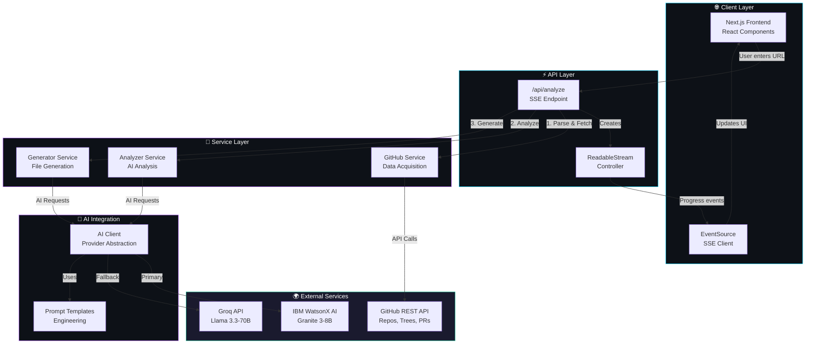

---

## 🔄 Data Flow Pipeline

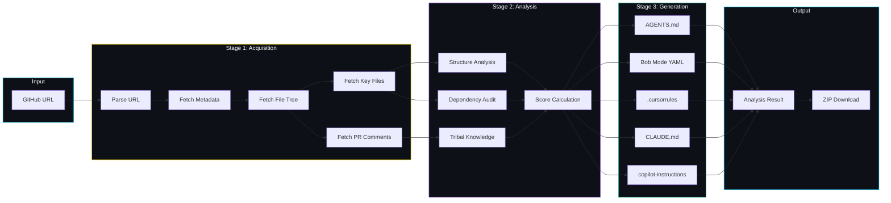

---

## 📡 SSE Streaming Timeline

```mermaid
gantt
    title AgentIQ Analysis Pipeline Timeline
    dateFormat X
    axisFormat %Ss

    section Fetching
    Parse URL           :0, 1s
    Fetch Metadata      :1s, 2s
    
    section Scanning
    Fetch File Tree     :2s, 4s
    Fetch Key Files     :4s, 7s
    
    section Analyzing
    AI Structure Analysis :7s, 12s
    
    section Tribal
    Extract PR Knowledge  :12s, 15s
    
    section Dependencies
    Audit Dependencies    :15s, 17s
    
    section Scoring
    Calculate Scores      :17s, 18s
    
    section Generating
    Generate 6 Files      :18s, 28s
    
    section Complete
    Send Final Result     :28s, 29s
```

---

## 🧩 Module Dependency Graph

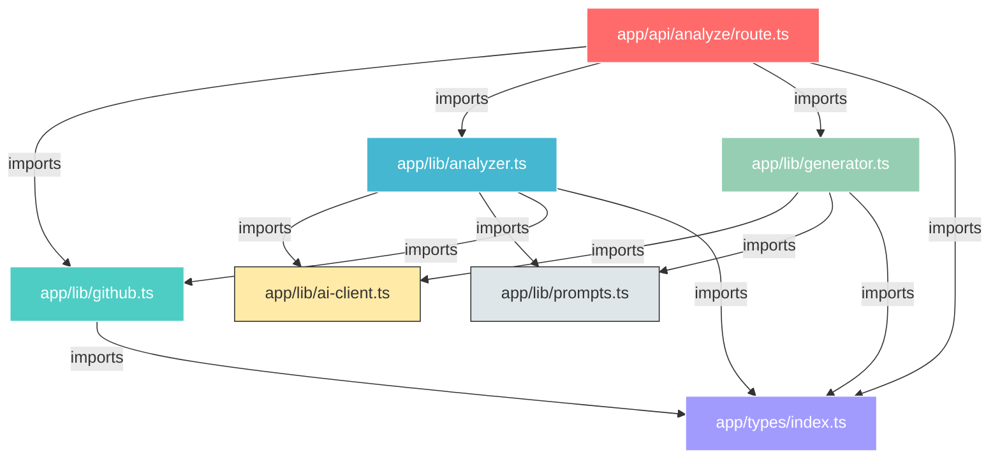

---

## 🤖 AI Provider Architecture

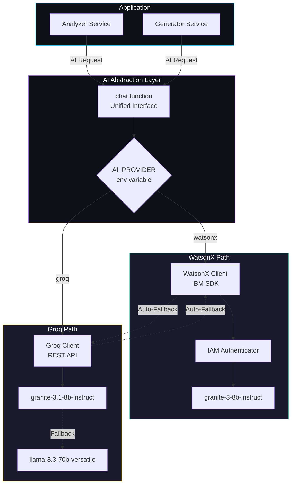

---

## 📊 Score Calculation Flow

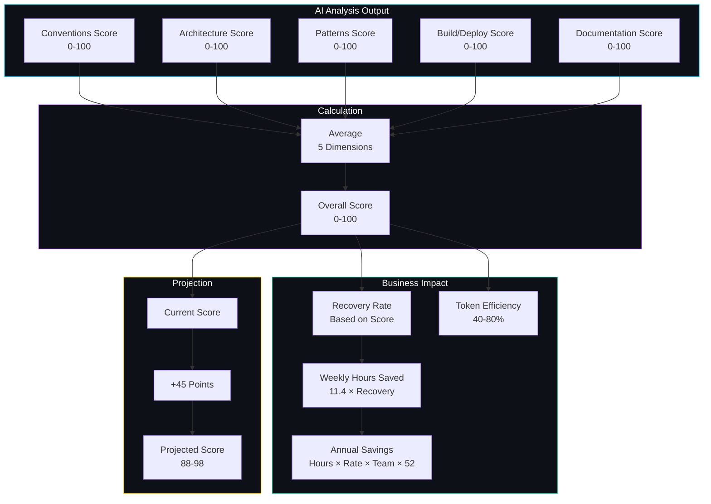

---

## 🔄 Error Handling & Fallback Strategy

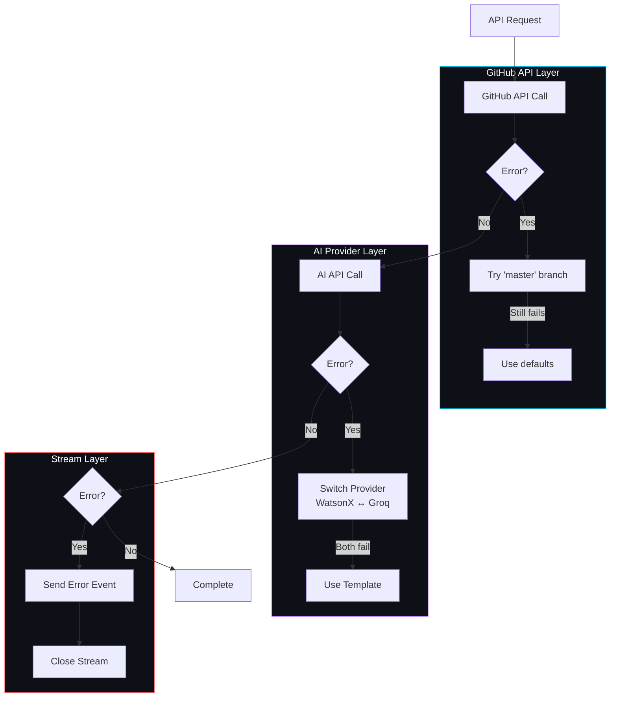

---

## 🎯 Context File Generation Parallel Processing

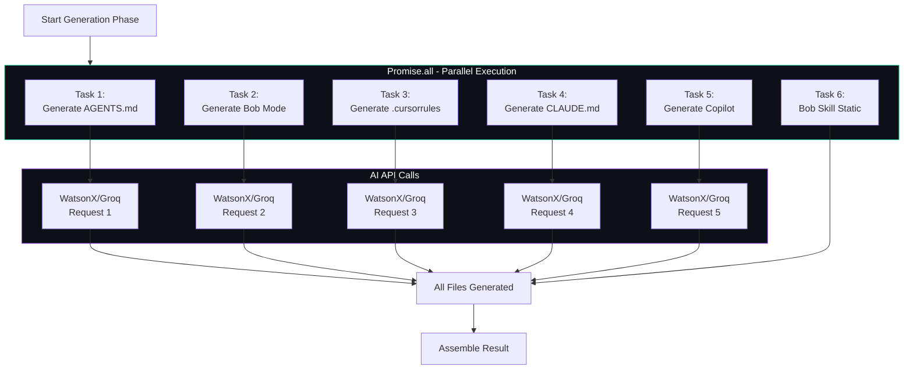

---

## 🗂️ File Organization Structure

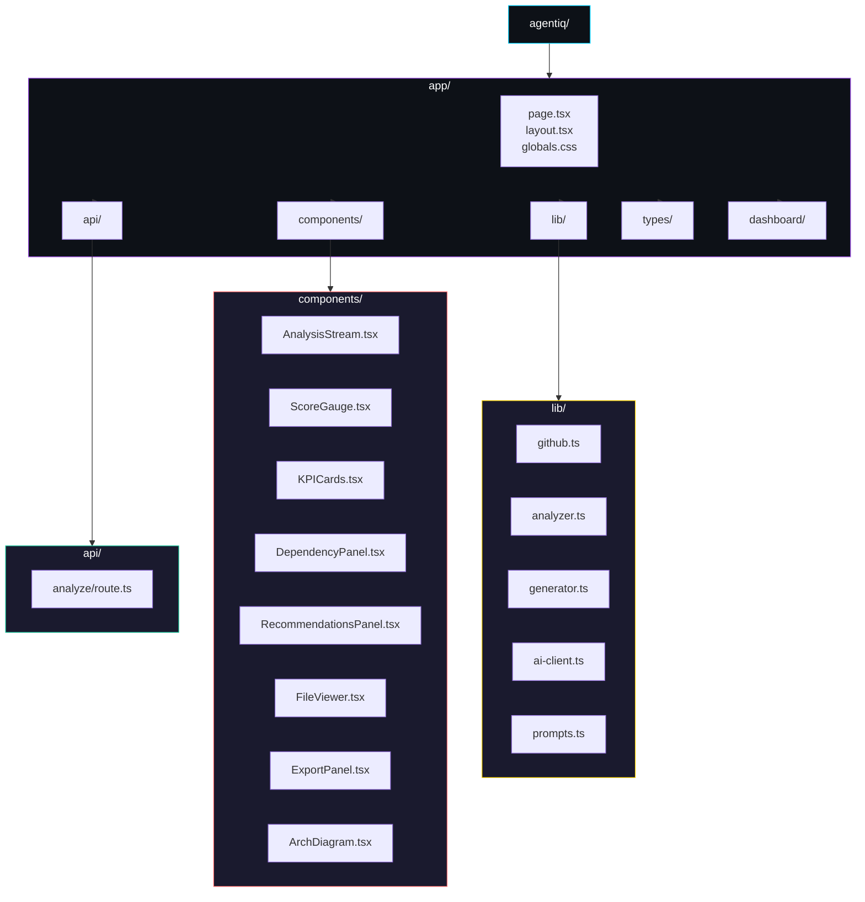

---

## 🔐 Configuration & Environment Flow

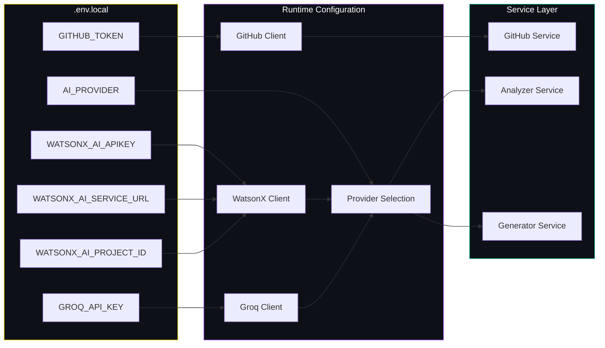

---

## 📈 Performance Optimization Points

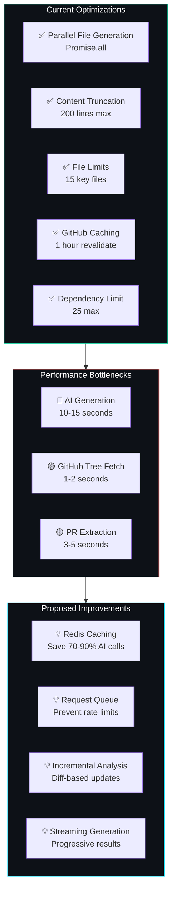

---

## 🎨 Component Interaction Flow

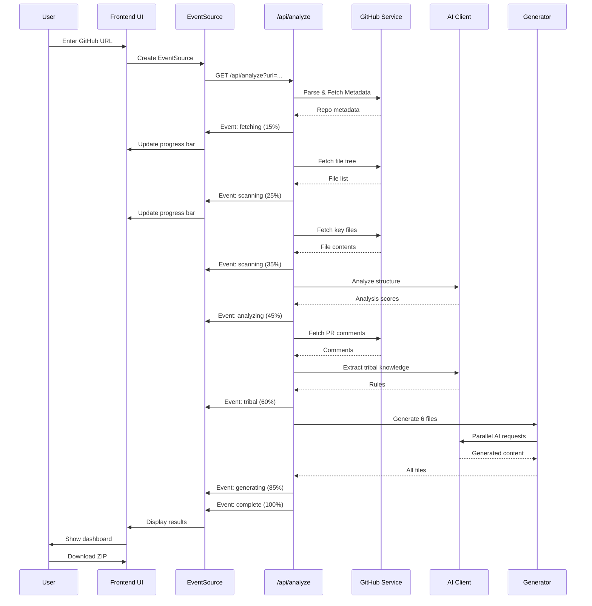

---

**Generated by:** Bob (Plan Mode)  
**Diagram Count:** 12 comprehensive visualizations  
**Coverage:** Complete system architecture, data flows, and interactions