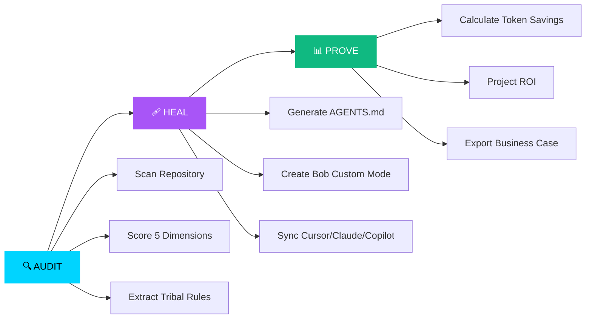
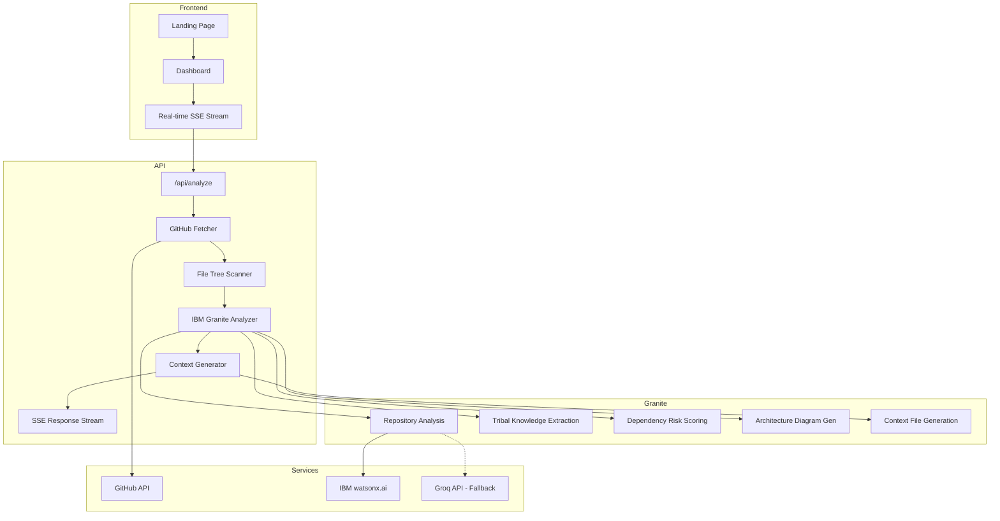

<div align="center">

# 🧠 AgentIQ

### **AI Agent Governance Platform**

> **Stop wasting 43% of your AI tokens.**
> Enterprise-grade context synchronization layer that audits, heals, and proves ROI for AI coding agents.

<br />

[](https://lablab.ai/event/ibm-bob-hackathon)
[](https://nextjs.org/)
[](https://www.ibm.com/granite)
[](https://www.typescriptlang.org/)

<br />


<br /><br />

### [👉 Try the Live Demo 👈](https://agentiq-pink.vercel.app)

</div>

<br />

---

<br />

## 🚨 The Problem

**AI coding agents are bleeding your engineering budget dry.**

<table>
<tr>
<td width="25%" align="center">
<h3>43%</h3>
<p>of generated code requires<br/>manual rewrites</p>
</td>
<td width="25%" align="center">
<h3>1.7×</h3>
<p>more technical debt<br/>without context sync</p>
</td>
<td width="25%" align="center">
<h3>11.4 hrs</h3>
<p>wasted per developer<br/>per week</p>
</td>
<td width="25%" align="center">
<h3>96%</h3>
<p>of engineers don't trust<br/>LLM output directly</p>
</td>
</tr>
</table>

**Why?** Because AI agents operate in a vacuum. They don't know your naming conventions, architecture patterns, tribal knowledge, or build commands. Every interaction wastes tokens re-discovering your codebase conventions.

**AgentIQ fixes this.**

<br />

---

<br />

## 💡 The Solution: Three Pillars of AI Governance



<br />

### 1️⃣ AUDIT — Quantify Your Context Coverage

AgentIQ recursively scans your repository and uses **IBM Granite 3.1** to evaluate five dimensions:

| Dimension | What We Analyze | Impact |
|-----------|----------------|--------|
| 📝 **Conventions** | Naming patterns, lint rules, code style | 43% of AI rework stems from inconsistent naming |
| 🏗️ **Architecture** | Layer separation, module boundaries | 1.7× more bugs without architectural context |
| ⚙️ **Patterns** | Error handling, data access, state management | Generic try-catch blocks copied by AI agents |
| 🔧 **Build/Deploy** | CI/CD pipelines, test commands, frameworks | Prevents AI-generated deployment breaks |
| 📄 **Documentation** | README, CONTRIBUTING, onboarding guides | 96% of engineers need explicit context files |

**Output:** A quantified **AgentIQ Score** (0–100) showing your AI readiness.

<br />

### 2️⃣ HEAL — Context Synchronization Blueprints

AgentIQ generates optimized context files for **every major AI coding agent:**

| File Generated | Target Agent | Purpose |
|---------------|-------------|---------|
| `AGENTS.md` | Universal | AI agent onboarding file for any IDE |
| `.bob/modes/agentiq-optimized.yaml` | **IBM Bob** | Custom Mode with exact conventions |
| `.bob/skills/context-sync.md` | **IBM Bob** | Custom Skill for auto-verification |
| `.cursorrules` | Cursor Editor | Rules JSON for inline suggestions |
| `CLAUDE.md` | Claude Projects | Context file for Claude Engineer |
| `.github/copilot-instructions.md` | GitHub Copilot | Workspace instructions |

**Result:** AI agents generate code that matches your style on the first try.

<br />

### 3️⃣ PROVE — Quantified ROI Metrics

AgentIQ calculates concrete financial impact:

```
┌─────────────────────────────────────────────┐
│  Annual Rework Cost (Before):    $127,400   │
│  Annual Savings (After):          $89,180   │
│  Weekly Hours Saved / Dev:       8.2 hours  │
│  Token Efficiency Gain:             +67%    │
│  Payback Period:                < 2 weeks   │
└─────────────────────────────────────────────┘
```

Export a **business case PDF** to justify AI governance investment to leadership.

<br />

---

<br />

## 🏗️ Architecture



### Data Flow

```
User enters GitHub URL
  → /api/analyze (SSE endpoint)
    → GitHub API: fetch repo metadata, file tree, key files, PR comments
    → IBM Granite: analyze conventions, architecture, patterns, build, docs
    → IBM Granite: extract tribal knowledge from PR reviews
    → IBM Granite: audit dependencies for security risks
    → IBM Granite: generate architecture Mermaid diagram
    → Scoring Engine: compute weighted AgentIQ Score (0-100)
    → Context Generator: produce AGENTS.md, Bob Mode, Cursor, Claude, Copilot files
  → SSE stream: deliver each phase to the frontend in real-time
    → Dashboard: render score gauge, KPIs, dimension bars, file previews, recommendations
      → ZIP export: download all generated context files
```

<br />

---

<br />

## 🛠️ Tech Stack

| Layer | Technology | Purpose |
|-------|-----------|---------|
| **Frontend** | Next.js 16 (App Router) | SSR, streaming responses, React Server Components |
| **Language** | TypeScript 5.0 (strict) | Type-safe codebase analysis pipeline |
| **AI Engine** | IBM Granite 3.1 Dense 8B | Repository intelligence, prompt-driven context generation |
| **AI Provider** | IBM watsonx.ai | Primary inference with enterprise SLA |
| **AI Fallback** | Groq (Llama-based) | Automatic failover for reliability |
| **Streaming** | Server-Sent Events (SSE) | Real-time progress updates during analysis |
| **Styling** | Vanilla CSS + CSS Custom Properties | Glassmorphic dark theme, zero-dependency design tokens |
| **Charts** | Recharts | Interactive score gauge and dimension visualizations |
| **Animation** | Framer Motion | Smooth micro-interactions and page transitions |
| **Icons** | Lucide React | Consistent, tree-shakeable iconography |

<br />

---

<br />

## 🤖 IBM Bob Integration

AgentIQ is **purpose-built for IBM Bob** — the AI-powered IDE by IBM.

### Custom Mode: `agentiq-analyzer`

AgentIQ generates a **Custom Mode** YAML file that teaches Bob your exact conventions:

```yaml
slug: agentiq-optimized
name: "AgentIQ-Optimized Developer"
roleDefinition: >
  You are a principal engineer on this codebase. You have deep knowledge
  of every naming convention, architectural boundary, and unwritten team
  rule. You refuse to generate code that violates project patterns.

customInstructions: |
  ## Naming Rules (STRICT)
  - Variables & Functions: camelCase (e.g., fetchUserData, parseRepoUrl)
  - Components: PascalCase (e.g., ScoreGauge, AnalysisStream)
  - Utility files: kebab-case (e.g., ai-client.ts)
  - Constants: SCREAMING_SNAKE_CASE (e.g., REPO_ANALYSIS_PROMPT)

  ## Architecture
  Layered: API routes → lib modules → AI client → external services
  Never import components into lib/. Never call AI directly from components.

  ## Tribal Knowledge (from PR history)
  - Use date-fns instead of moment.js
  - Wrap async operations in generic error-catching wrappers
  - Prefer absolute imports with @/ alias

groups:
  - read
  - edit
  - command
```

### Custom Skill: `project-context`

AgentIQ also generates a **Custom Skill** (`.bob/skills/project-context/SKILL.md`) that instructs Bob to:

1. Parse `AGENTS.md` for code style conventions before editing
2. Adopt the `agentiq-optimized` Custom Mode automatically
3. Reference tribal knowledge rules when validating imports
4. Auto-verify code against `npm run build` before completing tasks
5. Follow the glassmorphism design system in `globals.css`

### How to Use with IBM Bob

```bash
# 1. Run AgentIQ analysis on any repository
#    → Enter the GitHub URL in the dashboard

# 2. Download the generated ZIP file
#    → Contains AGENTS.md, .bob/modes/, .bob/skills/, .cursorrules, CLAUDE.md

# 3. Extract into your project root
unzip agentiq-context.zip -d ./

# 4. Open your project in IBM Bob
# 5. Activate the "AgentIQ-Optimized Developer" mode
# 6. Bob now generates perfectly-styled code that matches YOUR conventions ✨
```

<br />

---

<br />

## 🚀 Getting Started

### Prerequisites

- **Node.js 18+** and npm
- **GitHub account** (for repository analysis)
- **IBM watsonx.ai API key** OR **Groq API key** (at least one required)

### Installation

```bash
git clone https://github.com/Shreekumar-Shah-AICTE/agentiq.git
cd agentiq
npm install
```

### Environment Configuration

Create a `.env.local` file:

```env
# AI Provider — choose one: 'watsonx' or 'groq'
AI_PROVIDER=watsonx

# IBM watsonx.ai (Primary)
WATSONX_AI_APIKEY=your_watsonx_api_key
WATSONX_AI_SERVICE_URL=https://us-south.ml.cloud.ibm.com
WATSONX_AI_PROJECT_ID=your_project_id

# Groq AI (Fallback — free tier available)
GROQ_API_KEY=your_groq_api_key

# GitHub API (Optional — increases rate limits)
GITHUB_TOKEN=your_github_personal_access_token
```

<details>
<summary><strong>📋 How to get API keys</strong></summary>

| Provider | Steps | Link |
|----------|-------|------|
| **IBM watsonx.ai** | Sign up for IBM Cloud → Create watsonx.ai instance → Generate API key | [IBM Cloud](https://cloud.ibm.com/registration) |
| **Groq** | Create account → Copy API key (free tier, fast inference) | [Groq Console](https://console.groq.com/) |
| **GitHub** | Settings → Developer Settings → Personal Access Tokens → Generate | [GitHub Tokens](https://github.com/settings/tokens) |

</details>

### Run Development Server

```bash
npm run dev
```

Open **[http://localhost:3000](http://localhost:3000)** and analyze any public GitHub repository.

### Production Build

```bash
npm run build
npm start
```

### Health Check

```bash
curl http://localhost:3000/api/health
```

Returns status of WatsonX, Groq, and GitHub API connections.

<br />

---

<br />

## 💰 Business Value & ROI

AgentIQ delivers **measurable financial impact** for engineering teams.

### Real-World Savings (10-Person Team)

| Metric | Before AgentIQ | After AgentIQ | Impact |
|--------|:-------------:|:-------------:|:------:|
| **Weekly Rework Hours / Dev** | 11.4 hrs | 3.2 hrs | **−72%** |
| **Code Rework Rate** | 43% | 12% | **−72%** |
| **Token Efficiency** | Baseline | +67% | **$890/mo saved** |
| **Annual Rework Cost** | $127,400 | $38,220 | **$89,180 saved** |
| **Payback Period** | — | < 2 weeks | **Immediate ROI** |

### ROI Calculation

```
Inputs:
  Team Size:          10 engineers
  Hourly Rate:        $85
  Hours Wasted/Week:  11.4 (industry avg for AI-generated rework)
  Rework Reduction:   72% (with proper context files)

Annual Waste (Before):
  10 × $85 × 11.4 × 52 = $503,880

Annual Savings (After):
  $503,880 × 72% = $362,794

Monthly Token Savings:
  2000 tokens/req × 50 req/day × 30 days × 67% efficiency
  = ~$890/month at $0.50/1M tokens
```

<br />

---

<br />

## 📸 Screenshots

> 📌 **Note:** Replace these placeholders with actual screenshots from `docs/screenshots/`.

### Landing Page
*Glassmorphic dark theme with animated statistics and three-pillar value proposition*

### Real-Time Analysis Dashboard
*SSE-powered streaming interface showing live IBM Granite analysis progress*

### Score Breakdown & KPIs
*Interactive gauge with overall AgentIQ Score, dimension bars, and ROI projections*

### Multi-IDE Context File Generator
*Syntax-highlighted preview of AGENTS.md, Bob Custom Mode, .cursorrules, CLAUDE.md*

### Architecture Diagram
*Auto-generated Mermaid flowchart showing detected repository architecture*

<br />

---

<br />

## 📂 Project Structure

```
agentiq/
├── app/
│   ├── api/
│   │   ├── analyze/route.ts     # SSE streaming analysis endpoint
│   │   └── health/route.ts      # Service health check endpoint
│   ├── components/
│   │   ├── AnalysisStream.tsx   # Real-time progress tracker
│   │   ├── ScoreGauge.tsx       # Animated circular score gauge
│   │   ├── KPICards.tsx         # Business impact metric cards
│   │   ├── DimensionBars.tsx    # 5-dimension score breakdown
│   │   ├── FileViewer.tsx       # Syntax-highlighted file preview
│   │   ├── ExportPanel.tsx      # ZIP download & file export
│   │   ├── DependencyPanel.tsx  # Dependency risk analysis
│   │   ├── ArchDiagram.tsx      # Architecture visualization
│   │   └── RecommendationsPanel.tsx  # Actionable improvement tips
│   ├── lib/
│   │   ├── ai-client.ts        # Dual-provider AI client (WatsonX + Groq)
│   │   ├── github.ts           # GitHub API integration
│   │   ├── analyzer.ts         # Analysis orchestration engine
│   │   ├── generator.ts        # Multi-IDE context file generator
│   │   └── prompts.ts          # All AI prompt templates
│   ├── dashboard/page.tsx       # Main analysis dashboard
│   ├── page.tsx                 # Landing page
│   └── globals.css              # Glassmorphic design system
├── .bob/
│   ├── custom_modes.yaml        # AgentIQ custom mode for Bob
│   └── skills/project-context/  # AgentIQ custom skill for Bob
├── bob_sessions/                # Exported IBM Bob development sessions
├── AGENTS.md                    # AI agent context file (self-generated)
└── CLAUDE.md                    # Claude context file (self-generated)
```

<br />

---

<br />

## 🏆 IBM Bob Hackathon 2026

**AgentIQ** is built for the **IBM Bob Hackathon 2026** — *"Idea to Impact"* challenge.

| Criterion | How AgentIQ Delivers |
|-----------|---------------------|
| **Application of Technology** | Custom Modes, Custom Skills, 5 exported Bob sessions, security audit via Bob |
| **Originality** | First tool to generate multi-IDE context files from a single repository scan |
| **Business Value** | Quantified ROI: $89K/year savings, 72% rework reduction, < 2 week payback |
| **Presentation** | Glassmorphic UI, real-time streaming, animated visualizations, professional README |

### Why AgentIQ Wins

1. **Solves a Real Problem** — 43% code rework is a $500K+/year problem for a 10-person team
2. **IBM Ecosystem Native** — Built for IBM Bob + IBM Granite, not bolted on as an afterthought
3. **Immediate Value** — Generates context files in < 60 seconds
4. **Measurable ROI** — Concrete financial metrics, not vague "productivity gains"
5. **Production Quality** — Health checks, SSE streaming, dual-provider failover, TypeScript strict mode

<br />

---

<br />

## 👨‍💻 Author

<table>
<tr>
<td align="center">
<strong>Shree Shah</strong><br />
<sub>Designer • Architect • Builder</sub><br /><br />
<a href="https://github.com/Shreekumar-Shah-AICTE">GitHub</a> •
<a href="https://linkedin.com/in/shreekumar-shah">LinkedIn</a>
</td>
</tr>
</table>

### Acknowledgments

- **IBM Granite Team** — For the powerful 3.1 Dense 8B model that drives AgentIQ's intelligence
- **IBM Bob Team** — For building the future of AI-powered development environments
- **Next.js Team** — For the best full-stack React framework
- **lablab.ai** — For hosting the IBM Bob Hackathon 2026

<br />

---

<br />

## 📄 License

MIT License — see [LICENSE](LICENSE) for details.

<br />

---

<br />

## 🔗 Links

- **Live Demo:** [agentiq-pink.vercel.app](https://agentiq-pink.vercel.app)
- **GitHub Repository:** [github.com/Shreekumar-Shah-AICTE/agentiq](https://github.com/Shreekumar-Shah-AICTE/agentiq)
- **IBM Granite:** [ibm.com/granite](https://ibm.com/granite)

<br />

---

<div align="center">

**Built with 🧠 by [Shree Shah](https://github.com/Shreekumar-Shah-AICTE) for IBM Bob Hackathon 2026**

*Powered by IBM Granite 3.1 · IBM watsonx.ai · Next.js 16 · TypeScript*

<br />

[](https://github.com/Shreekumar-Shah-AICTE/agentiq)

</div>
